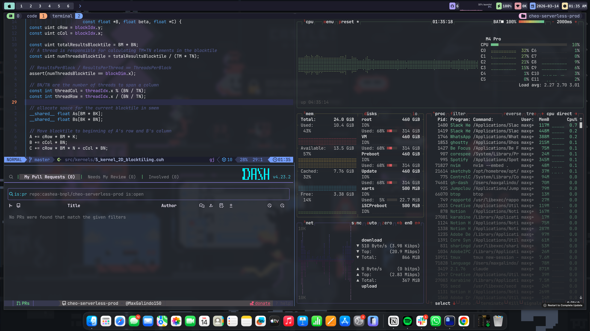

# Dotfiles

<div align="center">


</div>



---

## Tools

| Tool | Purpose |
|------|---------|
| [Ghostty](https://ghostty.org) | Terminal emulator |
| [Neovim + LazyVim](https://lazyvim.org) | Editor |
| [tmux](https://github.com/tmux/tmux) | Terminal multiplexer |
| [AeroSpace](https://github.com/nikitabobko/AeroSpace) | Tiling window manager |
| [Sketchybar](https://github.com/FelixKratz/SketchyBar) | Custom menu bar |
| [Starship](https://starship.rs) | Shell prompt |
| [Karabiner-Elements](https://karabiner-elements.pqrs.org) | Keyboard remapping |
| [Hammerspoon](https://www.hammerspoon.org) | macOS automation |
| [Atuin](https://atuin.sh) | Shell history |
| [oh-my-zsh](https://ohmyz.sh) | Zsh framework |

---

## Prerequisites

Install [Homebrew](https://brew.sh) first:

```bash
/bin/bash -c "$(curl -fsSL https://raw.githubusercontent.com/Homebrew/install/HEAD/install.sh)"
```

Then install all tools:

```bash
brew install neovim tmux starship atuin stow
brew install --cask ghostty aerospace sketchybar karabiner-elements hammerspoon
```

Install [Hack Nerd Font](https://www.nerdfonts.com) (required by Neovim and Sketchybar):

```bash
brew install --cask font-hack-nerd-font
```

---

## Install

Clone and symlink everything with [stow](https://www.gnu.org/software/stow/):

```bash
git clone https://github.com/<your-user>/dotfiles ~/.dotfiles
cd ~/.dotfiles
stow .
```

---

## Per-tool setup

### Ghostty
Config is symlinked to `~/.config/ghostty/config`. Launches with no extra steps.

### Neovim (LazyVim)
Plugins are managed by [lazy.nvim](https://github.com/folke/lazy.nvim) and auto-installed on first launch:

```bash
nvim
```

### tmux
Install plugins with [tpm](https://github.com/tmux-plugins/tpm):

```bash
git clone https://github.com/tmux-plugins/tpm ~/.tmux/plugins/tpm
tmux
# Inside tmux: prefix + I  (Ctrl+A then Shift+I)
```

Key prefix is `Ctrl+A`. Main bindings:

| Key | Action |
|-----|--------|
| `prefix \|` | Split vertical |
| `prefix -` | Split horizontal |
| `prefix h/j/k/l` | Navigate panes |
| `prefix H/L` | Previous / next window |
| `prefix o` | Session picker (sessionx) |

### AeroSpace
Config is symlinked to `~/.config/aerospace/aerospace.toml`. Runs on login. Add it to **Login Items** in System Settings → General → Login Items.

### Sketchybar
Start the service:

```bash
brew services start sketchybar
```

Reload config after changes:

```bash
sketchybar --reload
```

### Starship
Ensure `eval "$(starship init zsh)"` is in your `~/.zshrc` (already included in this config).

### Karabiner-Elements
Open Karabiner-Elements from Applications. Config is symlinked to `~/.config/karabiner/karabiner.json` — it loads automatically.

### Hammerspoon
Open Hammerspoon from Applications and enable Accessibility permissions when prompted. Config is at `~/.hammerspoon/init.lua`.

### Atuin
Login (optional, for sync):

```bash
atuin login
```

Shell integration is already in `.zshrc`.

---

## Shell (zsh)

Config is at `~/.zshrc`. Uses oh-my-zsh with `zsh-autosuggestions`. Custom keybindings:

| Key | Action |
|-----|--------|
| `Ctrl+E` | Accept suggestion |
| `Ctrl+W` | Execute suggestion |
| `Ctrl+K/J` | History search up/down |
